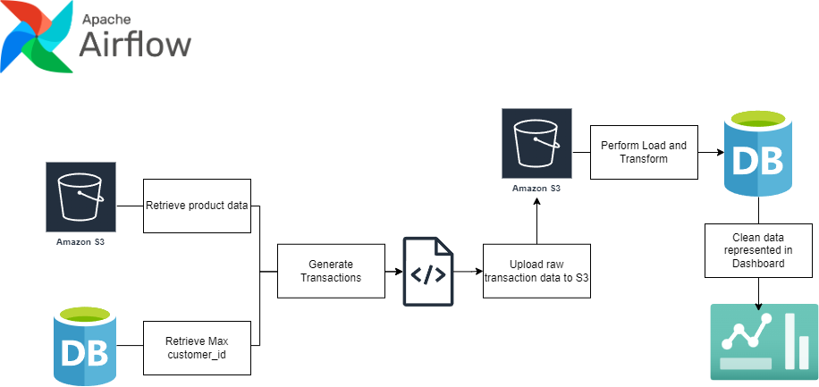

# Clothing Franchise Data Pipeline
This project implements a comprehensive data pipeline for generating and processing synthetic transaction data for a clothing store franchise. The pipeline automates the creation of fake transactions, handles data cleaning tasks, and performs Extract, Load, and Transform (ELT) operations until the data is ready for visualization. The primary objective of this project is to test dbt-core as a data processing framework, apache airflow as a workflow orchestrator, as well as evaluating Tableau as a dynamic analytical tool and dashboard.

## :ledger: Index

- [About](#beginner-about)
- [How?](#zap-usage)
- [File Structure](#file_folder-file-structure)
- [Resources](#page_facing_up-resources)
- [Gallery](#camera-gallery)

##  :beginner: About
This project began with the goal of practicing dashboarding skills using Tableau. However, unable to find a suitable dataset, I decided to create my own synthetic transaction data for a clothing store franchise. As I built the data generation process, I realized it could be applied in an Airflow DAG for an incremental ELT (Extract, Load, Transform) process, simulating a continuous data stream.
Rather than generating perfectly formatted data, I purposely created the original data in a different format, requiring the use of a transformation tool like dbt-core (Data Build Tool). This allowed me to learn and incorporate various frameworks, including Airflow, Docker, Snowflake, and AWS Cloud services.
The resulting pipeline generates synthetic transaction data, cleans and transforms it using dbt-core, and loads it into a data warehouse. The data is then visualized in a Tableau dashboard. While the pipeline may not be optimized, with some steps out of order, the goal was to gain hands-on experience with multiple data engineering tools and frameworks within a real-world project context. This project did finally allow me to practice my dashboarding skills but also exposed me to a diverse range of data engineering technologies

## :zap: How?
Here's a summary explaining how the DAG works:
    The dag/dbt-pipeline DAG performs the following steps:

1. **Fetch Data Sources:** It retrieves a list of all sold items by the franchise from an S3 bucket, where the prices are in Indian Rupees (INR).
2. **Get Max Customer ID:** The DAG fetches the maximum customer ID from the database to ensure that new customers are not assigned duplicate IDs after their first purchase.
3. **Generate Transactions:** It generates a specified number of transactions, including both new and returning customers, following a predetermined ratio. The sale prices of items are converted to CAD by looking up the conversion rate on the transaction date through an api call.
4. **Upload Raw Data:** The raw transaction data is uploaded to an S3 bucket.
5. **Create Staging Tables:** The DAG creates or replaces the staging tables in Snowflake and copies the raw data using dbt (Data Build Tool).
6. **Transform and Load:** The raw data is transformed and loaded into the analytics warehouse using dbt.
7. **Connect to Tableau Dashboard:** The analytics warehouse is connected to a Tableau dashboard, which immediately reflects the changes in the data.



This DAG automates the entire process of fetching data sources, generating synthetic transaction data, staging, transforming, and loading the data into a data warehouse, which is then visualized in a Tableau dashboard.


##  :file_folder: File Structure

```
.
├── config (airflow)
├── dags (airflow)
│   ├── scripts (data generation)
│   └── dbt-pipeline.py
│
├── dbt (dbt-core)
├── Dockerfile
├── docker-compose.yaml
└── requirements.txt
```

##  :page_facing_up: Resources
Link to my final dashboard.
https://public.tableau.com/app/profile/shayne.lussier/viz/ClothingStore-Dashboard/Dashboard

Link to the data generated by my project.
https://kaggle.com/datasets/aa297cec6eb77d7ddbfd5c9ba09b57df072c81ad4336431d76c35f2447c010c4

Links to resources used during this project.

https://www.youtube.com/watch?v=toSAAgLUHuk&ab_channel=JieJenn (dbt-core)
https://airflow.apache.org/docs/apache-airflow/stable/howto/docker-compose/index.html (airflow docker setup)
https://www.amazon.ca/Fundamentals-Data-Visualization-Informative-Compelling/dp/1492031089 (data viz)
https://docs.snowflake.com/en/user-guide/security-column-ddm-use (snowflake data masking for sensitive data)

##  :snowflake: Snowflake DB Setup
```
-- Initialize Database
CREATE DATABASE STORE

CREATE SCHEMA STORE.STAGING

CREATE SCHEMA STORE.ANALYTICS

-----------------------------------------------

-- fact table kept at the most granular level
CREATE TABLE analytics.transactions_fact (
    transaction_item_id VARCHAR(50) PRIMARY KEY,
    transaction_id VARCHAR(50),
    customer_id INT,
    store_id INT,
    transaction_date NUMBER(38, 0) NOT NULL,
    product_id VARCHAR(20),
    item_price DECIMAL(10, 2)
);

-----------------------------------------------

CREATE TABLE analytics.customers_dim (
    customer_id INT PRIMARY KEY,
    first_name VARCHAR(40),
    last_name VARCHAR(40),
    email VARCHAR(255),
    address VARCHAR(255),
    phone VARCHAR(25),
    extension VARCHAR(10),
    card_number VARCHAR(50)
);


-- Create mask on credit card column
CREATE OR REPLACE MASKING POLICY mask_card_number AS (val VARCHAR)
RETURNS VARCHAR
BEGIN
  RETURN REGEXP_REPLACE(val, r'^(.{16}).*$', '****\1');
END;

CREATE OR REPLACE MASKING POLICY mask_card_number AS (val VARCHAR) returns VARCHAR ->
  CASE
    WHEN current_role() IN ('ACCOUNTADMIN') THEN VAL
    ELSE REGEXP_REPLACE(val, '^(.*)(.{4})$', '****\\2')
  END;

ALTER TABLE analytics.customers_dim ALTER COLUMN card_number SET MASKING POLICY = mask_card_number;

-----------------------------------------------

CREATE TABLE analytics.products_dim (
    product_id INT PRIMARY KEY,
    product_name VARCHAR(255),
    product_brand VARCHAR(100),
    gender VARCHAR(20),
    price DECIMAL(10, 2),
    manufacturing_cost DECIMAL(10, 2),
    description VARCHAR,
    primary_colour VARCHAR(50)
);

-----------------------------------------------

CREATE TABLE analytics.date_dim (
  date_id NUMBER(38, 0) PRIMARY KEY NOT NULL,
  calendar_date DATE NOT NULL,
  year INT NOT NULL,
  month INT NOT NULL,
  monthname VARCHAR(16) NOT NULL,
  day INT NOT NULL,
  dayname VARCHAR(16) NOT NULL,
  day_of_week INT NOT NULL,
  week_of_year INT NOT NULL,
  is_weekday BOOLEAN NOT NULL,
  is_weekend BOOLEAN NOT NULL,
  is_holiday BOOLEAN DEFAULT FALSE
);

INSERT INTO analytics.date_dim (date_id, calendar_date, year, month, monthname, day, dayname, day_of_week, week_of_year, is_weekday, is_weekend)
SELECT
    CAST(CONCAT(DATE_PART(YEAR, calendar_date), LPAD(DATE_PART(MONTH, calendar_date), 2, '0'), LPAD(DATE_PART(DAY, calendar_date), 2, '0')) AS NUMBER) AS date_id,
    calendar_date,
    YEAR(calendar_date) AS year,
    MONTH(calendar_date) AS month,
    MONTHNAME(calendar_date) AS monthname,
    DAY(calendar_date) AS day,
    DAYNAME(calendar_date) AS dayname,
    DAYOFWEEK(calendar_date) AS day_of_week,
    WEEKOFYEAR(calendar_date) AS week_of_year,
    CASE WHEN DAYOFWEEK(calendar_date) IN (1, 7) THEN FALSE ELSE TRUE END AS is_weekday,
    CASE WHEN DAYOFWEEK(calendar_date) IN (1, 7) THEN TRUE ELSE FALSE END AS is_weekend
FROM (
    SELECT
        DATEADD(DAY, SEQ8(), DATE '2022-01-01') AS calendar_date
    FROM TABLE(GENERATOR(ROWCOUNT => 731))
);

-----------------------------------------------

-- create an external stage for the s3 bucket holding json data
CREATE OR REPLACE STAGE s3_data_pipeline_repo
URL='s3://data-pipeline-repo/transactions/'
CREDENTIALS=(
    AWS_KEY_ID='placeholder',
    AWS_SECRET_KEY='placeholder'
);

GRANT USAGE ON STAGE s3_data_pipeline_repo TO ROLE ACCOUNTADMIN;


-----------------------------------------------

-- create stream and task to automatically load changes to products.csv
CREATE OR REPLACE STAGE s3_products
URL='s3://data-pipeline-repo/products/'
CREDENTIALS=(
    AWS_KEY_ID='placeholder',
    AWS_SECRET_KEY='placeholder'
);

GRANT USAGE ON STAGE s3_data_pipeline_repo TO ROLE ACCOUNTADMIN;

CREATE OR REPLACE STREAM products_stream
ON EXTERNAL STAGE @s3_products
FILE_FORMAT = (TYPE = CSV, FIELD_DELIMITER = ',', SKIP_HEADER = 1);

CREATE OR REPLACE TASK analytics.merge_products_dim_task
  WAREHOUSE = COMPUTE_WH
  SCHEDULE = 'USING CRON 0 0 * * * UTC'
AS
  CALL MERGE INTO analytics.products_dim  AS tgt
    USING (
      SELECT 
        $1::INT AS product_id,
        $2::VARCHAR(255) AS product_name,
        $3::VARCHAR(100) AS product_brand,
        $4::VARCHAR(20) AS gender,
        $5::DECIMAL(10, 2) AS price,
        $6::DECIMAL(10, 2) AS manufacturing_cost,
        $7::VARCHAR AS description,
        $8::VARCHAR(50) AS primary_colour
      FROM products_stream
    )  AS src
    ON tgt.product_id = src.product_id
    WHEN MATCHED THEN
      UPDATE SET
        product_name = src.product_name,
        product_brand = src.product_brand,
        gender = src.gender,
        price = src.price,
        manufacturing_cost = src.manufacturing_cost,
        description = src.description,
        primary_colour = src.primary_colour
    WHEN NOT MATCHED THEN
      INSERT (
        product_id,
        product_name,
        product_brand,
        gender,
        price,
        manufacturing_cost,
        description,
        primary_colour
      )
      VALUES (
        src.product_id,
        src.product_name,
        src.product_brand,
        src.gender,
        src.price,
        src.manufacturing_cost,
        src.description,
        src.primary_colour
      );


ALTER TASK analytics.merge_products_dim_task RESUME;

```
